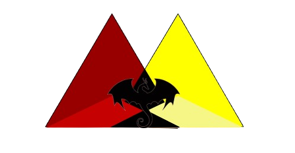

# Delta Dragons

Meet the Delta Dragons! We are a rookie FIRST Tech Challenge (FTC) robotics team based in Dunloggin Middle School, composed of 12 passionate student innovators. 
Building on our successful foundation in FIRST Lego League (FLL) last year, we are moving up to FTC to start actually building robots ourselves. 
Through our community outreach, we connect with local businesses to form mutually beneficial sponsorships. 

 

Along the way we learn CAD, machining, programming in Java, and just as much about outreach, fundraising,
and working together. Everyone on the team has a role, and every member gets hands-on time with the robot.

